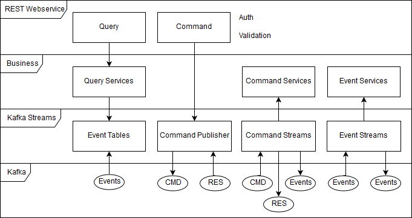

# OSCM Common / Service Tools

## Overview

The service tool implementation consists of multiple modules:

- `oscm-common-build` - Base project for building all modules. 
- `oscm-common-interfaces` - Collection of interfaces, basic data classes and exceptions on that all other modules and services rely on.  
- `oscm-common-jersey` - Implementation of the frontend with the Jersey REST framework.
- `oscm-common-kafka` - Implementation of the backend with the Kafka Streams client.
- `oscm-common-util` - Collection of utility classes used by other modules and services.

## Architecture

The service tools make heavily use of the command and event sourcing patterns for microservices in Java. They implement a generic frame that let services focus on their business logic without thinking too much about technology. The tools consist of multiple layers that are represented in the submodules (with the exception of util). The backend for every application is Apache Kafka, that serves as messaging service and data storage.  

The entrypoint for external systems is the REST frontend with two endpoints: commands and queries. For every request filters validate the content, the identity of the caller and their permissions.

After that, commands will be directly published into the command topic of the application in Kafka. Kafka distributes them over all available instances of the service and ensures loadbalancing and scaling. The command streams filter the topic for a specific command execute their corresponding business logic. The result is published back to Kafka and returned to the frontend. Also events encapsulated in the result are published to their own topic.

Queries use these event topics as they read them like a table. The corresponding service of a query processes the data and returns the result to the frontend.

Independently event streams react to changes in an event topic and process the event in their business logic. The result is then published to another (or the same) event topic.

## Frontend

Description of the endpoints and the implementation details are found [here](./oscm-common-jersey).

## Backend

Configuration details on Apache Kafka and the implementation of Kafka Streams are found [here](./oscm-common-kafka)

## Implementation

After installing the archetype and generating a project from it, you get several modules with sample classes:

- `oscm-<application>-build` - Base project for building all modules and also contains the generated Dockerfile.
- `oscm-<application>-interfaces` -  Collection of event classes and necessary enums.
- `oscm-<application>-main` - Module for the application server class with the main method that orchestrates the application.
- `oscm-<application>-services` - Collection of service classes with the business logic.

To model your own business logic for the service tools, you have to take serveral steps:

1. Create events in the interfaces module by extending the `Event` class. You will need to implement all inherited methods.

2. Adapt or create all enumerations that implement required keys:
  - `ActivityKey` - Defines all commands and queries with their entities and parameters.
  - `ApplicationKey` - Defines all applications (microservices) that this application interacts with (including itself).
  - `ConfigurationKey`- Defines configuration parameters for the application.
  - `ConsumerKey` - Defines all consumers for any entities.
  - `EntityKey`- Defines all entities and their event classes.
  - `MessageKey` - Defines messages for logging and exceptions.
  - `TransitionKey` - Defines all transitions from one entity to another.
  - `VersionKey` - Defines all versions of the application.
  
3. Write your business logic. Note that the methods that will be called by the tools must comply to the corresponding functional interface:
  - `CommandService`
  - `ConsumerService`
  - `QueryService`
  - `TransitionService`

4. Create a new main class that extends `ApplicationServer`. Orchestrate your application in the start method by initializing the `ConfigurationManager` and all necessary streams. Set the method references of your services and other resources in the `ServiceManager`. Start the streams and the webserver with the REST API. Implement a graceful shutdown in the stop method.

## Configuration

### http-port
Optional. Http port for the REST API endpoints. Default: 8080

### http-context
Optional. Http context for the REST API endpoints. Default: oscm

### ssl-keystore-location
Mandatory. Path to the java keystore with the SSL certificate.

### ssl-keystore-password
Mandatory. Password for the java keystore with the SSL certificate.

### http-request-timeout
Optional. Time limit for pending http request for commands. Default: 60

### auth-token-secret
Mandatory. Secret for signing the json web token with HMAC.

### kafka-servers
Mandatory. Comma separated list of Kafka bootstrap servers.

## Authorization

The authorization at the REST endpoints relies on JSON web tokens. These tokens carry roles as a claim, which define the access rights of the caller. Also for each activity (commands and queries) a list of roles is configured that is compared with the claim. If there is a matching role, the caller is authorized.

Activities are also saved in the configuration file with a comma separated list of roles as value. An activity without roles can not be accessed.
