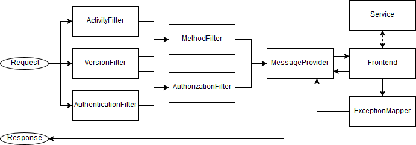

# OSCM Common REST API

The frontend offers two important endpoints per application:
```
POST https://<host>:<port>/<context>/<version>/commands/<key>
POST https://<host>:<port>/<context>/<version>/queries/<key>
```

`host`, `port` and `context` are defined by the application configuration, while `version` must be a valid `VersionKey`. `key` describes a `ActivityKey` of the corresponding type (command or query). Also the `Authorization` field in the HTTP-header must contain a valid JSON web token. These parameters are consumed by several filters and validated:



`ActivityFilter`, `AuthenticationFilter` and `VersionFilter` extract their parameters from the url or the HTTP-header. Activities and versions are checked against the ones registered in the `ConfigurationManager`, while the JSON web token is verified against the configured secret. The token claims and the keys for activity and version are saved in a `ServiceRequestContext` and forwarded to the next filters. The `MethodFilter` checks the allowed versions for a activity with the requested one and the `AuthorizationFilter` compares the callers roles from the token with the ones configured for the activity. At last the `MessageProvider` deserializes the `Event` in payload according to the class defined by the activity key. The event is updated to the current version and validated before the request is consumed by the frontend.

The returned data or exception will be saved in a `Result` object. Exceptions are therefore mapped by the `ExceptionMapper`. The result is serialized in the `MessageProvider`and returnd to the caller as response.


Besides these main endpoints also a health check for external applications such kubernetes exists:
```
GET http://<host>:<port>/<context>/health
```

It simply returns an empty response with status code `200 (OK)`.