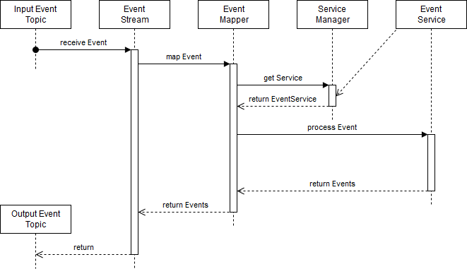

# OSCM Common Kafka API

## Concepts

The Kafka API consists of four different streams that cover most of the needed functionality.

### CommandProducer

The command producer writes commands into the command topic of the configured application. It monitors the corresponding result topic for matching result and uses a callback object to return it. The command producer can be used as singleton, so only one instance per target application is necessary.

### CommandStream

### EventStream

### EventTable

## Conventions

### Topics

All topic names are generated by the tools as the following:

- Commands: `<application>-command`
- Results: `<application>-result`
- Events: `<application>-<entity>`

`application` and `entity` are the names of the corresponding `ApplicationKey` or `EntityKey` that the topic belongs to. Every application has exactly one command and one result topic. Applications are allowed to write to command topics of other applications. *IMPORTANT:* Never write to a foreign result or entity topic!  

### Application ID

Every stream requires an application id that is generated as the following:

- CommandProducer: `<application>-<target>-<version>`
- CommandStream: `<application>-<command>-<version>`
- EventStream: `<application>-<transition>-<version>`
- EventTable: `<application>-<entity>-<version>`

`application` and `target` are the names of the owning or the target application. `command`, `transition` and `entity` are the names of the corresponding `ActivityKey`, `TransitionKey` or `EntityKey`. `version` is the current `VersionKey` of the executing application.

## Broker configuration

The Apache Kafka broker needs to be configured with the following settings to with the tools:

- `log.cleanup.policy=compact` *IMPORTANT:* Without this setting data gets lost over time. 