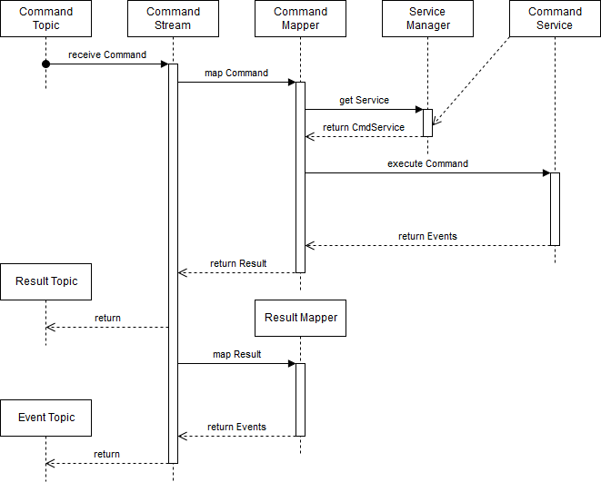

# OSCM Common Kafka API

## Concepts

The Kafka API consists of four different streams that cover most of the needed functionality. Every stream is used as singleton, since the multithreading is handled by Kafka Streams.

### CommandProducer

The command producer writes commands into the command topic of the configured application. It monitors the corresponding result topic for matching results and uses a callback object to return them.

### CommandStream

The command stream reads from applications command topic and filters it for the configured command. The command is forwarded to the corresponding service instance, which is retrieved through the `ServiceManager`. The resulting events from the execution are wrapped into a result object and written back into the result topic. From there a new stream reads the results and extracts the events which are written in their own topic.

### ConsumerStream

The consumer stream simply reads from an event topic and executes the corresponding service without any return value.

### TransitionStream

The transition stream works similar to the command stream. It reads from an event topic and processes events for its configured transition. The corresponding service returns events that are written into another (or the same) event topic.

### TimedStream

The timed stream is variant of the transition stream. Instead of executing the corresponding service once, it is scheduled as a task with a configured intervall and called periodically. All events the service returns are written to the output topic. The task is unscheduled when the service returns `null`.  

### EntityTable

The event table reads from its configured event topic. It caches the data as a table with the current state in a local database (that is managed by Kafka Streams). 

## Conventions

### Topics

All topic names are generated by the tools as the following:

- Commands: `<application>-command`
- Results: `<application>-result`
- Events: `<application>-<entity>`

`application` and `entity` are the names of the corresponding `ApplicationKey` or `EntityKey` that the topic belongs to. Every application has exactly one command and one result topic. Applications are allowed to write to command topics of other applications. **IMPORTANT:** Never write to a foreign result or entity topic!  

### Application ID

Every stream requires an application id that is generated as the following:

- CommandProducer: `<application>-<target>-<version>`
- CommandStream: `<application>-<command>-<version>`
- ConsumerStream: `<application>-<consumer>-<version>`
- TransitionStream: `<application>-<transition>-<version>`
- EntityTable: `<application>-<entity>-<version>`

`application` and `target` are the names of the owning or the target application. `command`, `consumer`, `transition` and `entity` are the names of the corresponding `ActivityKey`, `ConsumerKey`, `TransitionKey` or `EntityKey`. `version` is the current `VersionKey` of the executing application.

## Broker configuration

The Apache Kafka broker needs to be configured with the following settings to work with the tools:

- `log.cleanup.policy=compact` **IMPORTANT:** Without this setting data gets lost over time. 